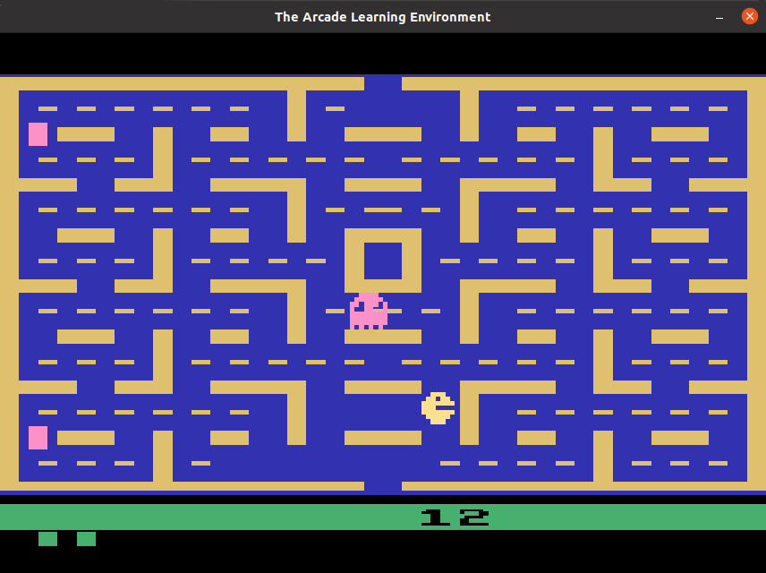
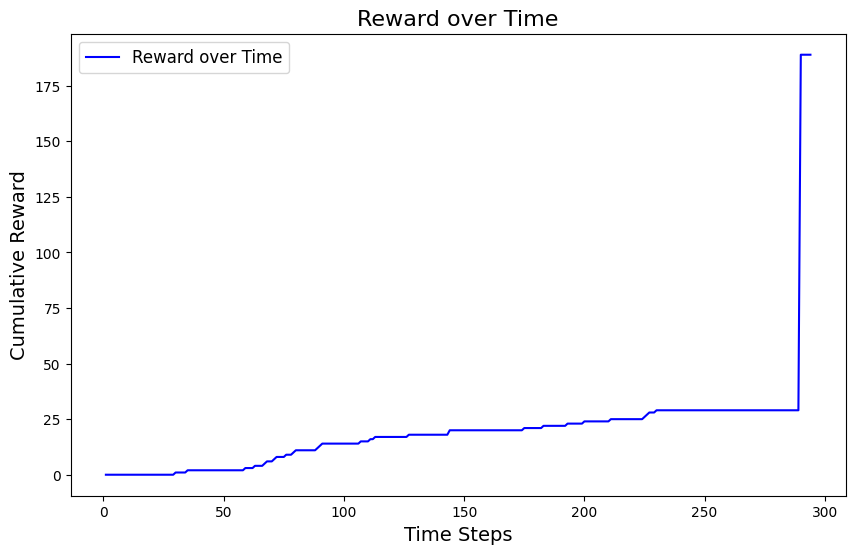
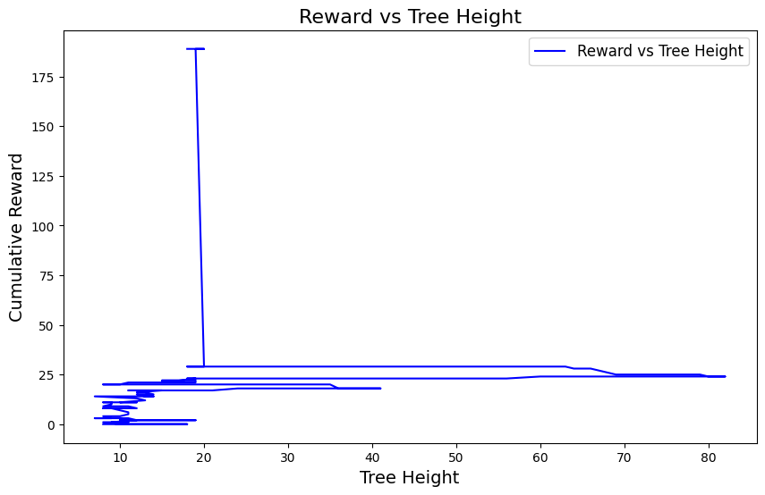
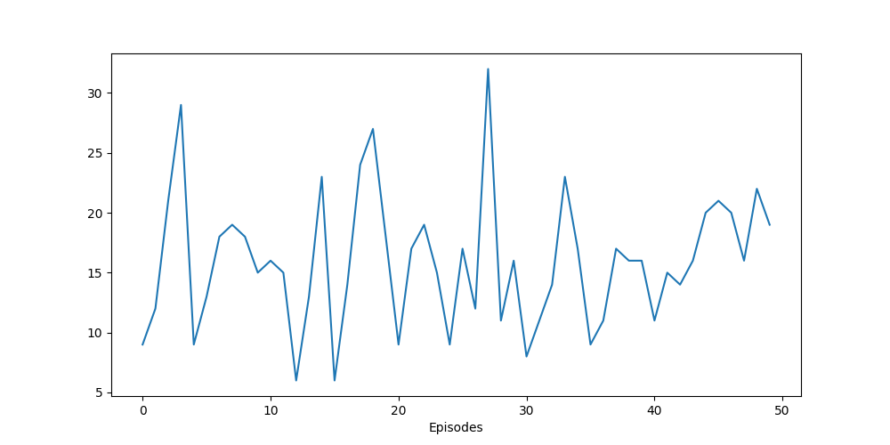
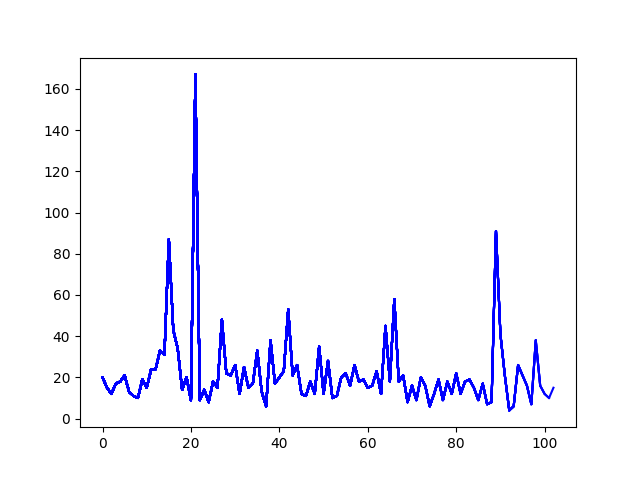
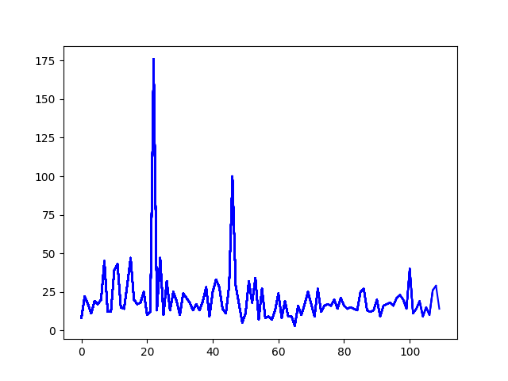
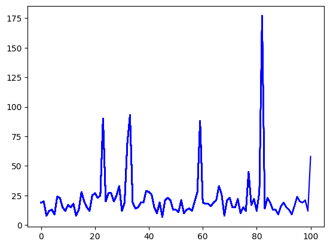
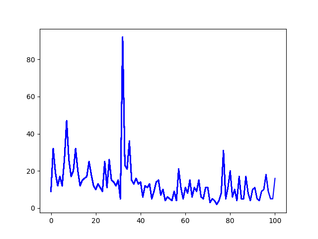
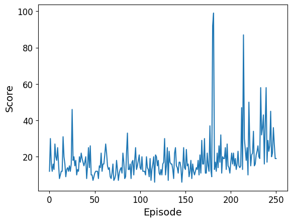

# Reinforcement Learning - Pacman

This project explores the application of Reinforcement Learning (RL) in the classic Pacman game. We implement and compare various RL algorithms, including Random Agent, Monte Carlo Tree Search (MCTS), Q-Learning, Deep Q-Learning (DQN), Double Deep Q-Learning (DDQN), and Stable Baselines3, to improve the agent's performance.


## Introduction

Pacman is a video game released in 1980 on Atari consoles, which quickly became a symbol of the video game industry and an important part of its history. This project aims to explore the application of Reinforcement Learning in the Pacman game, using different algorithms to improve the agent's performance. We analyze their efficiency and compare the results obtained.

## Environment

We use the Pacman environment from Atari Gymnasium ([Arcade Learning Environment](https://ale.farama.org/environments/pacman/)).

<p style="text-align: center;">
    
    <br>
    <em>ALE/Pacman-v5</em>
</p>


### Interaction with the Environment

- States are given as RGB frames of 250x160 pixels.
- The player has 5 actions: NOOP, UP, DOWN, LEFT, RIGHT.
- Rewards correspond to the score: 1 for each pellet, 50 for power pellets, and 100 for each ghost.
- The number of remaining lives is also provided.

### Preprocessing

To improve performance, we preprocess the environment:
- Reduce frame size to 84x84 pixels.
- Convert images to grayscale.
- Group frames in sets of 4 or apply a frameskip of 4.

```python
env = wrappers.AtariPreprocessing(env, frame_skip=4, grayscale_obs=True, screen_size=84)
```

## Random Agent
A baseline agent that takes random actions. It achieved an average score of 13.2 over 10 episodes.

## Monte Carlo Tree Search (MCTS)
MCTS is suitable for large environments and balances exploration and exploitation using the UCT formula. After running for approximately 3 hours, it achieved a reward of 189 after 294 actions.


<p style="text-align: center;">
    
    
</p>


## Q-Learning
We implemented Q-Learning without neural networks. Due to memory constraints, the Q-table size grew rapidly, and the algorithm required a large number of episodes for convergence.

<p style="text-align: center;">
    
    <br>
    <em>Q-Learning Reward over Time</em>
</p>

## Deep Q-Learning (DQN)
We used a DQN for Q-function approximation. Preprocessing and normalization were applied to improve learning. Results of reward over time varied based on the learning rate:

<p style="text-align: center;">
    
    
</p>

We also experimented with a bonus for staying alive and a larger batch size:

<p style="text-align: center;">
    
    
</p>

## Double Deep Q-Learning (DDQN)
We implemented DDQN to improve performance and convergence. The learning rate was set to 0.0005, and frames were grouped in sets of 4. After 250 episodes, the agent showed an upward trend in rewards.

<p style="text-align: center;">
    
    <br>
    <em>DDQN Reward over Time</em>
</p>

## Stable Baselines3
To speed up training, we used Stable Baselines3 with vectorized environments. After 3.3 million steps on 16 parallel environments, the agent achieved an average reward of 183.6 over 10 episodes.

## Conclusions
The agents start to learn and achieve good scores, but they require more episodes and training time. Each method presented its challenges and optimization opportunities, contributing to a deeper understanding of how agents can learn and adapt to complex environments.

## References

- [Arcade Learning Environment](https://ale.farama.org/environments/pacman/)
- [Stable Baselines3](https://stable-baselines3.readthedocs.io/en/master/)
